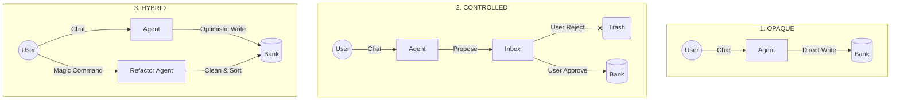

# Context Engineering: UX-Centric Memory Architectures

> **"Remettre l'Utilisateur au cœur de la mémoire artificielle."**

Welcome to the official repository of the **Context Engineering** study. This project demonstrates that memory management in AI Agents is not just a backend optimization problem (Vector DBs), but a fundamental **User Experience (UX)** challenge.

We compare three architectural paradigms to handle Long-Term Memory (LTM):

1.  **Opaque ("The Black Box")**: The industry standard. High friction, low trust.
2.  **User-Controlled ("The Gatekeeper")**: Explicit validation. High trust, high friction.
3.  **Hybrid ("The Gardener")**: Optimistic ingestion with "Magic Refactoring". The ideal balance.

---

## 🏗️ Architectures

### 1. Opaque (demos/opaque)
*   **Philosophy**: "Trust the System"
*   **Mechanism**: Every interaction is vectorized and stored in a hidden `OpaqueBank`.
*   **UX**: Read-Only view. The user sees what the AI knows but cannot change it.
*   **Risk**: Context Poisoning (AI remembers errors forever).

### 2. User-Controlled (demos/user_controlled)
*   **Philosophy**: "Zero Trust"
*   **Mechanism**: AI proposes facts to an `Inbox`. They are pending until approval.
*   **UX**: Checkpoint Dashboard. User must click ✅ or ❌ for every single fact.
*   **Benefit**: 100% Clean Memory.
*   **Cost**: High Cognitive Load (Data Entry fatigue).

### 3. Hybrid (demos/hybrid)
*   **Philosophy**: "Optimistic but Curated"
*   **Mechanism**: AI writes to `HybridBank` immediately (like Opaque) to keep flow.
*   **UX**: "Magic Edit". The user can perform natural language refactoring operations later.
    *   *Example: "Forget all expensive restaurants and keep only the vegan ones."*
*   **Result**: Fluid conversation + Control when needed.

---

## 🚀 Quick Start

### Prerequisites
*   Python 3.10+
*   Docker (for Weaviate local) or Weaviate Cloud Sandbox
*   `GOOGLE_API_KEY` (Gemini Models)
*   `WEAVIATE_URL` & `WEAVIATE_API_KEY`

### Installation

```bash
# Clone repo
git clone https://github.com/EZFRICA/context-engineering.git
cd context-engineering

# Install dependencies (using uv or pip)
pip install -r requirements.txt
```

### Running the Demos
We provide a unified launcher script that starts all 3 demos + the backend API on separate ports.

```bash
chmod +x run.sh
./run.sh
```

| Demo | URL | Description |
| :--- | :--- | :--- |
| **Opaque** | `http://localhost:8501` | The Standard Baseline |
| **User-Controlled** | `http://localhost:8502` | The Validation Flow |
| **Hybrid** | `http://localhost:8503` | The Target Experience |

---

## 🧪 Testing

We include a suite of automated scenarios to validate the memory ingestion and retrieval logic.

### Stress Test: "The Vegan Wedding"
This scenario simulates a user with strict constraints changing their mind, testing if the architecture fails (Opaque) or adapts (Hybrid).

### Run Unit Tests
```bash
python -m pytest tests/
```

---

## � Technical Deep Dive

The core differentiation lies in the `MemoryEngine` implementation across the three demos.



### Key Components
*   **Supervisor (LangGraph)**: Routes between Research and Planning.
*   **MemoryWorker**: Asynchronous background process that extracts facts from conversation.
*   **Weaviate**: Vector Database storing the schemas (`OpaqueBank`, `UserInbox`, `HybridBank`, etc.).

---

## 💡 Key Findings: The Illusion of Autonomous Memory

Our extensive testing with the **"Vegan Wedding" Scenario** (a stress test involving conflicting constraints: *Steakhouse Enthusiast* vs *Strictly Vegan Event*) revealed critical limitations in modern agentic architectures.

### 1. The Failure of "Smart" Ingestion (Context Poisoning)
In the **Opaque** architecture, the agent attempted to reconcile the conflict by merging them. It stored:
> *"User loves traditional French steakhouses."*
> *"User wants a vegan wedding."*

**Result**: Context Poisoning. The general preference ("Loves Steakhouses") became a permanent "Zombie Memory." In future sessions unrelated to the wedding (e.g., "Planning a business lunch"), the agent continued to suggest steakhouses, having failed to understand that the initial preference was purely situational.

### 2. The Limits of Agent Autonomy
In the **Hybrid** experiments, we gave the Agent explicit tools (`delete_memory`) and strict "System Override" prompts to heal its own memory.
*   **The Behavior**: Instead of surgically removing the incorrect fact, the Agent often **hallucinated the correction**. It would reply *"Okay, I've removed your preference for meat,"* while seemingly just adding a *new* memory note: *"User clarified they only wanted the vibe, not the meat."*
*   **The Problem**: The vector database became cluttered with contradictory layers of "corrections," increasing token usage and confusion over time. The Agent prioritized conversational politeness over database hygiene.

### 3. The UX Imperative
This study concludes that **Long-Term Memory cannot be purely algorithmic.**

*   **Trust requires Visibility**: Users generally do not trust an agent that says "I forgot," unless they can *see* the data disappear.
*   **The Dashboard is the Garbage Collector**: Since LLMs are probabilistic, they cannot be trusted with definitive data deletion. A **User-Controlled Interface** (Inbox or Scope Dashboard) is not just a feature—it is a strict requirement for preventing long-term model degradation.

> **Final Thesis**: The solution to AI Hallucinations in RAG systems is not a better vector database, but a better **Frontend for Memory Management**.

---

**Author**: Ezekias Bokovo for Context Engineering Study.
